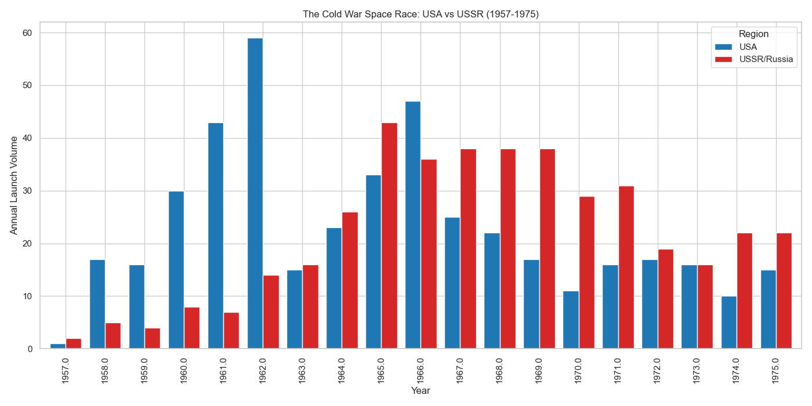
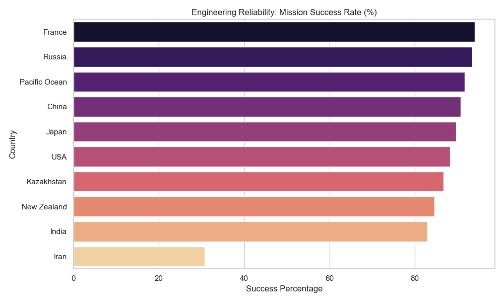

# Global Space Mission Analysis (1957 – Present)

## 🚀 Project Overview
This project performs an end-to-end exploratory data analysis (EDA) on over 60 years of global space flight history. By cleaning and transforming raw mission data, I’ve mapped the evolution of the global space race—from the Cold War rivalry between the USA and USSR to the modern era of commercial and international expansion.

## 🛠️ Technical Stack
*   **Language:** Python 3.10+
*   **Libraries:** 
    *   `Pandas`: Data wrangling, UTC datetime normalization, and feature engineering.
    *   `Matplotlib` & `Seaborn`: Advanced statistical visualization and trend analysis.
*   **Version Control:** Refactored for compatibility with **Seaborn 0.13+**, ensuring future-proof execution by removing deprecated styling and plotting functions.

## 📈 Key Insights & Results

### 1. The Superpower Rivalry (1957-1975)
During the "Space Race" era, the analysis reveals that while the United States achieved high-profile milestones (Apollo), the **USSR maintained a significantly higher annual launch volume**, often doubling the US output during the mid-1960s to maintain their orbital infrastructure.



### 2. Engineering Reliability: Mission Success Rates
By calculating the mean success rate across the top 10 space-faring nations, the project identifies:
*   **High-Volume Consistency:** How established players like Russia and the USA maintain stability over thousands of launches.
*   **Emergent Precision:** The success ratios of newer players like India and China as they scale their orbital capabilities.



## 🧹 Data Engineering Highlights
*   **Geopolitical Mapping:** Handled the complexity of the Baikonur Cosmodrome (Kazakhstan) by mapping it to the USSR/Russia region to maintain historical data integrity.
*   **Robust Cleaning:** Developed a parsing pipeline to handle inconsistent currency formats in launch pricing and "dirty" location strings.
*   **Time-Series Normalization:** Converted mixed-format date strings into UTC-aware datetime objects to allow for accurate year-over-year growth comparisons.
*   **Deprecated Code Refactoring:** Updated legacy `sns.set()` and `palette` logic to modern Seaborn standards to prevent `FutureWarnings`.

## 📂 Repository Structure
```text
├── mission_launches.csv        # Raw Dataset
├── space_analysis.py           # Refactored Analysis Script
├── space_race_comparison.png   # Visualization: Cold War Trends
├── success_rate_by_country.png  # Visualization: Reliability Metrics
└── README.md                   # Project Documentation
